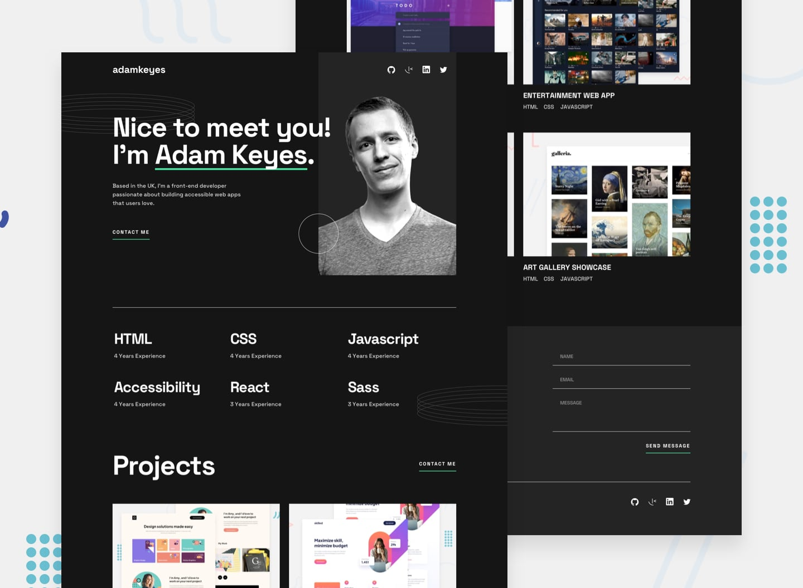

## Welcome! 👋
This project showcases my front-end development skills by creating a responsive contact form using HTML, CSS, and JavaScript. The form includes various input fields and validation for user input, ensuring that all required fields are completed and in the correct format. The design of the form was carefully crafted using CSS, making use of modern techniques like flexbox and grid to create a clean and intuitive user interface. Overall, this project demonstrates my proficiency in web development, particularly in HTML, CSS, and JavaScript.

## Table of contents

- [Links](#links)
- [Built with](#built-with)
- [What I learned](#what-i-learned)
- [Continued development](#continued-development)

### Built with 🧱

- Semantic HTML5 markup
- CSS custom properties
- Flexbox
- CSS Grid
- SASS
- Mobile-first workflow

### Links

- Live Site URL 🔴: [https://guiyee89.github.io/web-dev-portfolio/]
- My Front-end Mentor profile 👦: [https://www.frontendmentor.io/profile/guiyee89]

### What I learned

Through this project, I learned how to build a responsive web page using HTML and CSS, and how to add interactivity to the page using JavaScript. Specifically, I gained experience in designing and structuring web pages with HTML, styling them with CSS, and using JavaScript to add dynamic functionality. I also learned how to implement form validation using regular expressions and JavaScript, allowing for user input to be checked for proper formatting before being submitted. Additionally, I gained experience in using Git for version control and collaborating with others on a project. Overall, this project provided me with a comprehensive understanding of the front-end web development process and allowed me to develop my skills in HTML, CSS, JavaScript, regular expressions, and Git.

### Continued development

This project will be continued by implementing AJAX to send form data to a server, store it in JSON format, and send it to an email.

